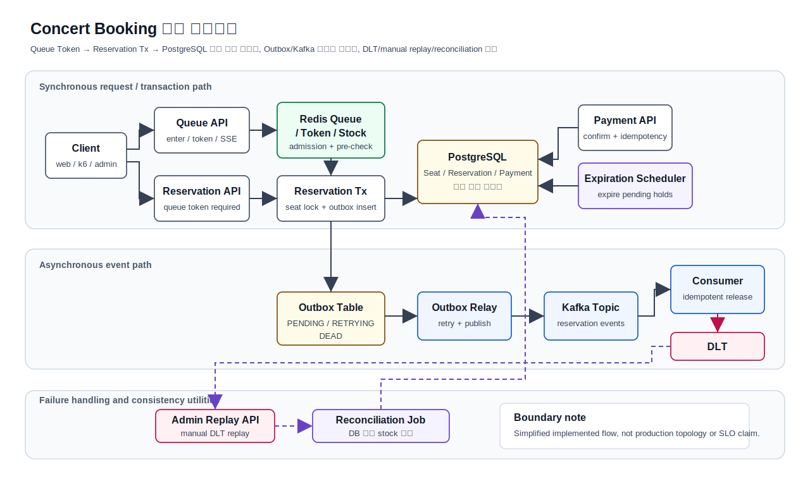
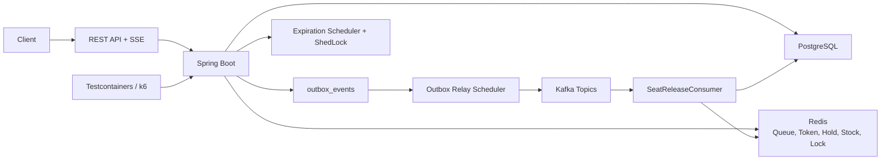

# Concert Booking


고동시성 콘서트 예매 상황에서 **동일 좌석 경합, 대기열 입장 제어, 중복 요청, 결제/만료 race,
Outbox/Kafka 이벤트 발행 실패**를 다루는 Spring Boot 백엔드 프로젝트입니다.

이 프로젝트는 단순한 예매 CRUD가 아니라, 실제 예매 시스템에서 쉽게 깨지는 **좌석 정합성, 락 전략,
멱등성, 이벤트 처리, Redis stock 불일치** 문제를 코드와 테스트로 검증하는 데 초점을 둡니다.

---

## 30초 요약

이 저장소가 증명하는 것은 **고동시성 예매 도메인에서 좌석 overselling, 대기열 token 우회, 중복 요청,
결제/만료 race, 이벤트 발행 실패를 어떻게 방어했는지**입니다.

가장 강한 근거는 다음 세 가지입니다.

| 근거 | 확인한 내용 | 범위 |
| --- | --- | --- |
| k6 측정 | 동일 좌석 100 concurrent requests에서 success 1, fail 99, overselling 0 | 로컬 Docker 단일 실행 |
| k6 측정 | 50명/50좌석 분산 예매에서 비관적 50/50, 낙관적 20/50, Redis 분산 락 50/50 | 로컬 Docker 단일 실행 |
| Testcontainers + 제한된 k6 검증 | 결제/만료 race, idempotency replay/conflict, 대기열 토큰 우회 차단 정책 | 시나리오 검증 |

이 저장소가 주장하지 않는 것도 명확히 분리합니다.

| 주장하지 않음 | 이유 |
| --- | --- |
| 운영 환경 TPS, SLO, capacity | 모든 성능 수치는 로컬 Docker 기준입니다. |
| 평균/표준편차/신뢰구간 | A/B/C는 단일 실행 결과입니다. |
| production-grade observability | metric contract와 local Prometheus artifact만 있습니다. |
| 자동 장애 복구 시스템 | DLT replay와 Redis stock reconciliation은 관리자 수동 utility입니다. |

---

## 전체 아키텍처



이 다이어그램은 구현된 핵심 흐름과 검증 대상 경계를 설명하기 위한 단순화된 구조도이며, 운영 배포 토폴로지나 production SLO를 주장하지 않습니다.

| 핵심 설계 판단 | 이유 | 경계 |
| --- | --- | --- |
| Queue Token을 Reservation Tx 앞단에서 검증 | 대기열 우회와 다른 사용자/다른 공연 일정 token 재사용을 막기 위해 | 시나리오 검증 |
| DB를 좌석 정합성의 최종 기준으로 유지 | Redis Queue/Token/Stock은 빠른 입장 제어와 선검증 캐시이며 불일치 가능성이 있음 | Testcontainers/k6 로컬 검증 |
| Outbox Table을 비즈니스 트랜잭션 안에 기록 | DB commit 이후 Kafka publish 실패로 이벤트가 사라지는 구간을 줄이기 위해 | Testcontainers 검증 |
| DLT, Admin Replay API, Reconciliation Job을 수동 경계로 분리 | 자동 복구 시스템이나 production SLO를 주장하지 않고 실패 대응 흐름을 제한하기 위해 | 로컬 검증 utility |

상세 설명과 편집 가능한 drawio 원본은 [docs/ARCHITECTURE.md](docs/ARCHITECTURE.md)에 정리했습니다.

---

## 핵심 문제

| 문제 | 구현한 대응 |
| --- | --- |
| 같은 좌석을 동시에 잡아도 overselling이 나면 안 됨 | 비관적/낙관적/Redis 분산 락 전략을 같은 API 계약에서 비교하고 테스트 |
| 대기열을 거치지 않고 예매 API로 바로 들어오면 안 됨 | Redis Sorted Set 대기열과 `userId + scheduleId` 바인딩 입장 토큰 |
| 더블클릭, timeout, 재시도가 중복 예매/결제로 이어지면 안 됨 | `Idempotency-Key`와 DB unique constraint로 replay/conflict 분리 |
| 결제, 취소, 만료가 동시에 실행되어 상태가 꼬이면 안 됨 | reservation row lock과 도메인 상태 전이 메서드 |
| DB commit 후 Kafka publish나 consumer 처리 실패가 사라지면 안 됨 | Outbox retry/backoff/DEAD, Spring Kafka DLT, 관리자 manual replay utility |

---

## 아키텍처 요약



주요 예매 흐름:

```text
queue enter
→ queue token issue
→ POST /api/reservations
  - queueToken body
  - Idempotency-Key header
→ seat HELD + reservation PENDING
→ POST /api/payments
  - Idempotency-Key header
  - mock payment
→ reservation CONFIRMED + seat RESERVED
→ outbox event 저장
→ relay가 Kafka publish
```

취소와 만료는 상태 전이 트랜잭션에서 좌석을 직접 반환하지 않습니다.
상태 전이는 outbox event만 남기고, 좌석 반환은 `reservation.cancelled` 이벤트를 받은 consumer가
`HELD` 좌석에 대해서만 멱등적으로 수행합니다.

---

## 주요 설계 결정

| 결정 | 이유 |
| --- | --- |
| Redis Sorted Set 대기열 | 진입 시각을 score로 저장하고 `ZRANK`로 순번 계산 |
| 입장 토큰을 `userId + scheduleId`에 바인딩 | 다른 사용자나 다른 공연 일정의 token 재사용 방지 |
| 예매 성공 후에만 token 소비 | 좌석 경합 실패 시 사용자가 다른 좌석으로 재시도할 수 있도록 유지 |
| 세 가지 reservation strategy 유지 | 같은 API 계약에서 비관적/낙관적/분산 락의 차이 비교 |
| Redis stock pre-check | 소진 이후 실패 요청이 DB transaction까지 진입하는 비용 감소 |
| DB final consistency | Redis stock은 캐시이며, 최종 기준은 DB `Seat.status = AVAILABLE` count |
| schedule-bound seat query | 요청 schedule에 속하지 않는 좌석 예매 방지 |
| `Idempotency-Key` | 중복 예매, 중복 결제, timeout 이후 재시도 방어 |
| Outbox Pattern | DB commit 이후 Kafka publish 실패로 이벤트가 사라지는 구간 완화 |
| Outbox retry/backoff/DEAD | 실패 이벤트를 무한 재시도하지 않고 운영적으로 격리 |
| DLT manual replay | Consumer 실패 메시지를 격리하고 관리자 수동 재처리 경로 제공 |
| Flyway migrations | `schema.sql` init 대신 versioned SQL migration으로 schema 관리 |
| Local observability metrics | 예매 실패 사유, queue token abuse, outbox backlog, stock mismatch를 로컬 검증용으로 관측 |

---

## 검증한 항목

### k6 Measured

| 시나리오 | 조건 | 결과 |
| --- | --- | --- |
| 동일 좌석 경합 | 동일 좌석 100 concurrent requests | success 1, fail 99, overselling 0 |
| 분산 좌석 예약 | 50명이 서로 다른 좌석 예매 | 비관적 50/50, 낙관적 20/50, Redis 분산 락 50/50 |
| 혼합 부하 테스트 | k6 200 VU, 70% 조회 + 30% 예매, 45초 | 총 RPS: 비관적 969, 낙관적 993, Redis 분산 락 1,005 |

> k6 결과는 로컬 Docker 단일 실행 기준입니다. 실제 운영 환경 수치가 아니며,
> 평균/표준편차/신뢰구간을 주장하지 않습니다.

상세 수치와 한계는 [docs/PERF_RESULT.md](docs/PERF_RESULT.md)에 정리했습니다.
결제와 만료 동시 실행 검증, 중복 요청 replay/conflict 검증,
대기열 토큰 우회 차단 검증은 짧은 smoke 실행, 비관적 락 단일 재현 실행,
세 가지 락 전략의 로컬 3회 반복 실행으로 정책 분기와 실패 조건을 다시 확인했습니다.
이 결과는 정합성 시나리오 검증 근거이며, 운영 성능 claim으로 사용하지 않습니다.

### Testcontainers Verified

| 검증 항목 | 대표 테스트 |
| --- | --- |
| 동일 좌석 오버셀링 방지 | `ConcurrencyIntegrationTest`, `DistributedLockConcurrencyTest`, `OptimisticLockConcurrencyTest` |
| 예약/결제 조회 소유권 | `AccessControlIntegrationTest` |
| 입장 토큰 필수 검증, 성공 후 소비, 실패 시 보존 | `QueueTokenPolicyIntegrationTest` |
| 요청 schedule과 seatIds 소속 검증 | `SeatScheduleValidationIntegrationTest` |
| 예매 idempotency와 DB unique constraint | `ReservationIdempotencyIntegrationTest` |
| 결제 idempotency와 중복 결제 차단 | `PaymentIdempotencyIntegrationTest` |
| 결제/취소/만료 race | `ReservationStateTransitionRaceIntegrationTest` |
| 좌석 반환 멱등성 | `SeatReleaseIdempotencyIntegrationTest` |
| Outbox 저장, relay 성공, 실패 재시도 | `OutboxIntegrationTest` |
| Kafka DLT와 replay | `KafkaDltReplayIntegrationTest` |
| Redis stock reconciliation | `StockReconciliationIntegrationTest` |
| 일반 admin endpoint의 `ROLE_ADMIN` 보호 | `AdminSecurityIntegrationTest` |
| 분산 락 실패 경로의 stock 복원 | `DistributedLockStockFailureIntegrationTest` |
| scheduler와 ShedLock 설정 로드 | `SchedulerConfigIntegrationTest` |
| k6 fixture reset endpoint | `LoadTestAdminControllerIntegrationTest` |

---

## 락 전략 비교

| 전략 | 직렬화 지점 | 장점 | 한계 |
| --- | --- | --- | --- |
| Pessimistic Lock | DB `SELECT ... FOR UPDATE` | 높은 경합에서 결과가 직관적 | lock wait와 DB connection 점유 |
| Optimistic Lock | JPA `@Version` + retry | 낮은 경합에서 lock wait가 적음 | 공유 row version 충돌 시 성공률 하락 |
| Redis Distributed Lock | Redis stock + MultiLock | 소진 후 실패를 DB 전에 차단 | Redis/DB reconciliation 필요 |

Scenario B에서 낙관적 락은 각 사용자가 서로 다른 좌석을 예매해도 같은
`ConcertSchedule.availableSeats` row를 갱신하기 때문에 version 충돌이 발생했습니다.
이 결과는 낙관적 락이 항상 부적합하다는 뜻이 아니라,
**공유 카운터 row가 있는 모델에서는 충돌 비용이 쉽게 드러난다**는 것을 보여줍니다.

---

## Outbox / Kafka / DLT

Outbox는 DB commit 이후 Kafka publish 실패로 이벤트가 사라지는 구간을 줄이기 위한 장치입니다.

```text
business transaction
→ INSERT outbox_events(status=PENDING)
→ commit
→ relay scheduler
→ Kafka publish
→ success: PUBLISHED
→ failure: FAILED + nextAttemptAt
→ max retry exceeded: DEAD
```

Outbox는 exactly-once를 보장하지 않습니다.
중복 발행 가능성은 consumer 멱등성으로 흡수합니다.

상태 전이는 운영 판단 기준으로도 분리합니다.

| 상태 | 의미 | 운영 조치 |
| --- | --- | --- |
| `PENDING` | DB transaction에 이벤트 발행 의도만 기록됨 | relay 대상 여부 확인 |
| `PUBLISHED` | Kafka publish 성공 | consumer 처리 결과와 DLT 확인 |
| `FAILED` | publish 실패 후 재시도 대기 | broker 상태와 `nextAttemptAt` 확인 |
| `DEAD` | 재시도 초과로 자동 relay 제외 | payload/idempotency 확인 후 제한된 manual replay |

DLT replay는 자동 복구 시스템이 아닙니다.
`ROLE_ADMIN` 권한으로 `/api/admin/dlt/replay`를 호출하는 **manual replay utility**입니다.

---

## Redis stock reconciliation

Redis stock은 빠른 선검증용 캐시입니다. 최종 기준 데이터는 DB입니다.

```text
DB Seat.status AVAILABLE count
→ StockReconciliationService
→ ConcertSchedule.availableSeats 비교
→ Redis stock 비교
→ dry-run mismatch report
→ repair=true 시 DB 기준으로 보정
```

Reconciliation endpoint:

```text
POST /api/admin/schedules/{scheduleId}/stock/reconcile?repair=false
POST /api/admin/schedules/{scheduleId}/stock/reconcile?repair=true
```

`repair=true`는 관리자 권한으로 수동 실행하는 보정 경로입니다.
Redis를 단일 진실 공급원으로 만들지 않습니다.

---

## Observability

Spring Boot Actuator와 Micrometer를 사용해 로컬 검증용 운영 지표를 노출합니다.

| Endpoint | 접근 정책 |
| --- | --- |
| `/actuator/health` | 인증 없이 조회 가능 |
| `/actuator/info` | 인증 없이 조회 가능 |
| `/actuator/metrics` | `ROLE_ADMIN` 필요 |
| `/actuator/prometheus` | `ROLE_ADMIN` 필요 |

대표 metric:

- 예매:
  `concert.booking.reservation.attempts`,
  `concert.booking.reservation.success`,
  `concert.booking.reservation.failures`,
  `concert.booking.reservation.latency`
- 대기열 token:
  `concert.booking.queue.token.issued`,
  `concert.booking.queue.token.validation.failures`,
  `concert.booking.queue.token.inflight.conflicts`
- Outbox relay:
  `concert.booking.outbox.published`,
  `concert.booking.outbox.failed`,
  `concert.booking.outbox.dead`,
  `concert.booking.outbox.publish.latency`,
  `concert.booking.outbox.events`
- Stock reconciliation:
  `concert.booking.stock.reconciliation.runs`,
  `concert.booking.stock.reconciliation.mismatches`,
  `concert.booking.stock.reconciliation.repairs`

Outbox gauge는 scrape마다 DB를 조회하지 않고, 주기적으로 갱신한 pending/failed/dead count를 노출합니다.
`PrometheusScrapeContractIntegrationTest`는 `monitoring/alert-rules.yml`과 Grafana dashboard가 참조하는
Prometheus metric name이 보호된 `/actuator/prometheus` 응답에 노출되는지 검증합니다.

> 이 섹션은 기본적인 관측 지표를 설명합니다. `monitoring/` 템플릿은 Prometheus/Grafana 문법과 synthetic
> alert rule expression, actuator metric name contract만 검증하며, 실제 alerting, dashboard, tracing, SLO
> 운영 체계까지 구현했다는 의미는 아닙니다. 실제 Prometheus server scrape 구성에는 bearer token 또는
> internal network/auth 정책이 필요합니다.
> `scripts/capture-monitoring-evidence.sh`는 local Prometheus server가 준비됐을 때 target/rule/query artifact를
> 남기는 도구이며, artifact 검토 전에는 운영형 observability claim으로 승격하지 않습니다.
> `SPRING_PROFILES_ACTIVE=local-monitoring`은 로컬 전용 ADMIN 계정을 만들어 Prometheus bearer token scrape를
> 검증하기 위한 profile입니다. production 인증/권한 운영 방식으로 해석하지 않습니다.

---

## 기술 스택

| 영역 | 기술 |
| --- | --- |
| Language | Java 21 |
| Framework | Spring Boot |
| Database | PostgreSQL |
| Migration | Flyway |
| Cache / Queue / Stock | Redis |
| Distributed Lock | Redisson |
| Messaging | Kafka |
| Security | Spring Security, JWT |
| Observability | Spring Boot Actuator, Micrometer, Prometheus |
| Test | JUnit 5, Testcontainers, Spring Kafka Test |
| Performance | k6 |
| Infra | Docker Compose |
| Build | Gradle Kotlin DSL |

---

## API 요약

### Queue

| Method | Path | 설명 |
| --- | --- | --- |
| `POST` | `/api/queue/enter` | 대기열 진입 |
| `GET` | `/api/queue/token?scheduleId={id}` | 입장 토큰 발급 |
| `GET` | `/api/queue/events` | SSE 순번 알림 |

### Reservation

| Method | Path | 설명 |
| --- | --- | --- |
| `POST` | `/api/reservations` | 좌석 예매. `queueToken` body, `Idempotency-Key` header 필수 |
| `GET` | `/api/reservations/{id}` | 본인 예매 조회 |
| `GET` | `/api/reservations/me` | 내 예매 목록 조회 |
| `DELETE` | `/api/reservations/{id}` | 본인 예매 취소 |

### Payment

| Method | Path | 설명 |
| --- | --- | --- |
| `POST` | `/api/payments` | mock payment. `Idempotency-Key` header 필수 |
| `GET` | `/api/payments/{id}` | 본인 결제 조회 |

### Admin

| Method | Path | 설명 |
| --- | --- | --- |
| `POST` | `/api/admin/dlt/replay` | `ROLE_ADMIN` 필요. DLT manual replay utility |
| `POST` | `/api/admin/schedules/{scheduleId}/stock/reconcile` | `ROLE_ADMIN` 필요. Redis stock reconciliation |
| `POST` | `/api/admin/load-test/reset` | `!prod` profile에서만 로드되는 k6 fixture utility |

---

## 실행 방법

### 1. 인프라 실행

```bash
docker compose up -d
```

### 2. 애플리케이션 실행

```bash
./gradlew bootRun
```

### 3. 락 전략 전환

```bash
./gradlew bootRun --args="--reservation.strategy=pessimistic"
./gradlew bootRun --args="--reservation.strategy=optimistic"
./gradlew bootRun --args="--reservation.strategy=distributed"
```

### 4. 테스트 실행

통합 테스트는 Testcontainers로 PostgreSQL, Redis, Kafka를 실행합니다. Docker가 필요합니다.

```bash
./gradlew test
./gradlew build
```

### 5. k6 fixture 생성

`/api/admin/load-test/**` endpoint는 로컬 부하 테스트 재현성을 위한 endpoint이며, `!prod` profile에서만 로드됩니다.

```bash
curl -X POST "http://localhost:8080/api/admin/load-test/reset?scheduleId=1&userCount=200"
curl "http://localhost:8080/api/admin/load-test/summary?scheduleId=1"
```

### 6. k6 실행

```bash
k6 run k6/scenario-a.js
k6 run k6/scenario-b.js
k6 run k6/scenario-c.js
```

전체 실행:

```bash
bash k6/run-all.sh
```

기본 전체 실행은 공개 측정 완료 항목인 scenario-a/b/c만 포함합니다.
결제와 만료 동시 실행 검증, 중복 요청 replay/conflict 검증,
대기열 토큰 우회 차단 검증은 짧은 smoke 실행, 비관적 락 단일 재현 실행,
세 가지 락 전략의 로컬 3회 반복 실행을 보존했습니다. 이 결과는 정합성 시나리오 검증 근거이며
운영 latency/throughput/capacity claim으로 사용하지 않습니다.
로컬 반복 검증 시나리오까지 함께 돌리려면 아래처럼 명시적으로 opt-in합니다.

```bash
INCLUDE_PENDING=1 bash k6/run-all.sh
```

대기열 토큰 우회 차단 smoke 실행 예시:

```bash
SMOKE=1 STRATEGY=pessimistic SCENARIO=scenario-f VUS=5 RUNS=1 USER_COUNT=4 SCHEDULE_ID=1 OTHER_SCHEDULE_ID=2 bash k6/run-all.sh
```

결과는 다음 경로에 저장됩니다.

```text
k6/results/{timestamp}/{strategy}/{scenario}/run-{n}/
├── reset.json
├── summary.json
├── events.json
├── k6.log
└── final-summary.json
```

---

## 성능 결과 요약

상세 내용은 [docs/PERF_RESULT.md](docs/PERF_RESULT.md)에 정리되어 있습니다.

### A. 동일 좌석 경합

조건: 100 VU, 동일 좌석 1개, per-vu-iterations 1회.

| 메트릭 | 비관적 락 | 낙관적 락 | Redis 분산 락 |
| --- | ---: | ---: | ---: |
| 성공 수 | 1 | 1 | 1 |
| 실패 수 | 99 | 99 | 99 |
| overselling | 0건 | 0건 | 0건 |
| p95 | 215ms | 106ms | 145ms |

### B. 분산 좌석 예약

조건: 50 VU, 50개 좌석, 각 VU가 서로 다른 좌석 1개 예매.

| 메트릭 | 비관적 락 | 낙관적 락 | Redis 분산 락 |
| --- | ---: | ---: | ---: |
| 성공률 | 100% (50/50) | 40% (20/50) | 100% (50/50) |
| p95 | 95ms | 215ms | 126ms |

### C. 혼합 부하 테스트

조건: 200 VU, 45초, 70% 조회 + 30% 예매.

| 메트릭 | 비관적 락 | 낙관적 락 | Redis 분산 락 |
| --- | ---: | ---: | ---: |
| 총 RPS | 969 | 993 | 1,005 |
| 읽기 p95 | 28ms | 9ms | 7ms |
| 쓰기 p95 | 37ms | 10ms | 6ms |
| 쓰기 성공 | 50 | 50 | 50 |

---

## 한계

| 항목 | 현재 한계 |
| --- | --- |
| 성능 수치 | 로컬 Docker 단일 실행 기준입니다. 실제 운영 환경 수치가 아닙니다. |
| k6 결과 | A/B/C는 단일 실행 결과입니다. 평균, 표준편차, 신뢰구간을 계산하지 않았습니다. |
| 세 시나리오 검증 | smoke 실행, 단일 재현 실행, 세 가지 락 전략의 로컬 3회 반복으로 정책 분기와 실패 조건을 확인했습니다. |
| 결제 | 외부 PG 연동이 아니라 mock payment 즉시 성공 구조입니다. |
| DLT replay | `ROLE_ADMIN` 권한으로 호출하는 manual utility입니다. 운영용 자동 복구 시스템이 아닙니다. |
| Admin 계정 | 기본 회원가입은 `USER` 권한만 생성합니다. admin 계정 발급/운영 절차는 별도 과제입니다. |
| Redis 장애 | Redis 장애 자동 fallback은 구현하지 않았습니다. DB 기준 reconciliation utility로 수동 보정합니다. |
| Observability | Actuator/Micrometer metric, contract test, local 템플릿과 scrape artifact는 있습니다. |
| Autoscaling | 배포 환경의 autoscaling과 운영 알림은 구현 범위에 포함하지 않았습니다. |

세 시나리오는 운영 성능 claim과 신뢰구간을 아직 주장하지 않습니다.
Observability는 실제 alert firing, dashboard 운영, tracing, SLO 체계를 아직 주장하지 않습니다.
관련 artifact는 `docs/evidence/monitoring/prometheus-20260522T155512Z/capture-summary.json`입니다.

---

## 문서

| 문서 | 내용 |
| --- | --- |
| [docs/ARCHITECTURE.md](docs/ARCHITECTURE.md) | 전체 구조도, 핵심 설계 판단, 장애/정합성 보정 경계 |
| [docs/DESIGN.md](docs/DESIGN.md) | 상태 전이, 대기열, 락 전략, Outbox/DLT, Redis reconciliation 설계 |
| [docs/PERF_RESULT.md](docs/PERF_RESULT.md) | k6 측정 결과와 추가 검증 예정 범위 |
| [docs/TESTING.md](docs/TESTING.md) | Testcontainers/k6가 어떤 claim을 지지하는지 정리 |
| [docs/RUNBOOK.md](docs/RUNBOOK.md) | Outbox DEAD, DLT replay, Redis stock mismatch, queue token abuse 대응 절차 |
| [docs/LIMITATIONS.md](docs/LIMITATIONS.md) | 아직 주장하지 않는 것과 다음 보강 과제 |
| [docs/LOCK_STRATEGY_GUIDE.md](docs/LOCK_STRATEGY_GUIDE.md) | 비관적/낙관적/Redis 분산 락 선택 기준과 측정 결과 해석 |
| [docs/INTERVIEW_GUIDE.md](docs/INTERVIEW_GUIDE.md) | 면접에서 설명할 핵심 질문과 안전한 답변 |
| [docs/STUDY_GUIDE.md](docs/STUDY_GUIDE.md) | 코드 흐름 학습 가이드 |

`monitoring/`에는 Prometheus/Grafana local verification 템플릿, actuator metric name contract test,
synthetic alert rule test와 local Prometheus scrape artifact가 있습니다. 실제 alert firing, dashboard 운영,
tracing, SLO 체계를 구현했다는 주장은 하지 않습니다.
