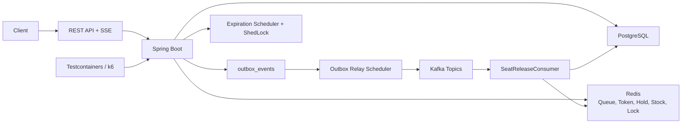

# Concert Booking

## One-line Summary

고동시성 콘서트 예매 시스템에서 Redis 대기열과 입장 토큰, 좌석 선점 TTL, 결제 만료, 락 전략 비교, Outbox/Kafka 이벤트 복구를 검증한 Spring Boot 백엔드입니다.

## Core Problems

이 프로젝트는 "좌석 예매 API를 만들었다"보다 한 단계 더 들어갑니다. 예매 시스템에서 실제로 문제가 되는 지점, 특히 같은 좌석 경합과 재시도, 결제/만료 race, 이벤트 발행 실패를 코드와 테스트로 다룹니다.

| 문제 | 구현한 대응 |
| --- | --- |
| 동일 좌석 경합에서 overselling 발생 가능 | 비관적 락, 낙관적 락, Redis 분산 락 전략을 분리하고 k6/통합 테스트로 비교 |
| 예매 API 직접 진입 위험 | Redis Sorted Set 대기열과 `userId + scheduleId` 바인딩 입장 토큰 |
| 결제 전 좌석 임시 점유 | `HELD` 좌석, Redis seat hold TTL, reservation `expiresAt` |
| 다른 schedule 좌석으로 예매되는 위험 | 좌석 조회를 `scheduleId + seatIds + AVAILABLE` 조건으로 제한 |
| 중복 예매/중복 결제 | HTTP `Idempotency-Key`와 DB unique constraint |
| 결제/취소/만료 동시 실행 | reservation row lock과 도메인 상태 전이 메서드 |
| DB commit 이후 Kafka publish 실패 | Outbox table과 relay scheduler |
| Consumer 처리 실패 | Spring Kafka DLT와 manual replay utility |
| Redis stock과 DB 불일치 | DB 기준 manual reconciliation utility |

## Architecture



주요 흐름은 다음과 같습니다.

```text
queue enter
→ queue token issue
→ POST /api/reservations (queueToken + Idempotency-Key)
→ seat HELD + reservation PENDING
→ POST /api/payments (Idempotency-Key, mock payment)
→ reservation CONFIRMED + seat RESERVED
→ outbox event 저장
→ relay가 Kafka publish
```

취소와 만료는 상태 전이 트랜잭션에서 좌석을 직접 반환하지 않고 outbox event를 저장합니다. 좌석 반환은 `reservation.cancelled` 이벤트를 받은 consumer가 `HELD` 좌석에 대해서만 수행합니다.

## Key Decisions

| 결정 | 이유 |
| --- | --- |
| Redis Sorted Set 대기열 | score를 진입 시각으로 두고 `ZRANK`로 순번을 계산하기 쉽습니다. |
| 입장 토큰을 `userId + scheduleId`에 바인딩 | 다른 사용자나 다른 공연 일정의 토큰 재사용을 막습니다. |
| 토큰 소비는 예매 성공 후에만 수행 | 좌석 경합 실패 시 사용자가 다른 좌석으로 재시도할 수 있어야 합니다. |
| 세 가지 ReservationService 전략 유지 | 같은 API 계약에서 비관적/낙관적/분산 락의 차이를 비교하기 위해 분리했습니다. |
| Redis stock pre-check | 분산 락 전략에서 소진 이후 실패 요청이 DB까지 들어가는 비용을 줄입니다. |
| DB final consistency | Redis stock은 캐시입니다. 최종 기준은 DB `Seat.status = AVAILABLE` count입니다. |
| 좌석은 요청 schedule에 속해야 함 | 세 락 전략 모두 schedule-bound seat query를 사용합니다. |
| `Idempotency-Key` | 사용자 더블클릭, timeout 이후 재요청, 결제 재시도를 DB unique constraint로 막습니다. |
| Flyway migrations | JPA DDL 자동 생성과 `schema.sql` init 대신 versioned SQL migration으로 스키마를 관리합니다. |
| Outbox Pattern | DB commit과 Kafka publish 사이의 이벤트 유실 구간을 줄입니다. |
| DLT + manual replay utility | Consumer 처리 실패를 격리하고, 로컬 검증용 수동 복구 경로를 제공합니다. |

## Evidence

### k6 Measured

| 시나리오 | 조건 | 결과 |
| --- | --- | --- |
| Hot Seat Contention | 동일 좌석 100 concurrent requests | success 1, fail 99, overselling 0 |
| Distributed Reservation | 50명이 서로 다른 좌석 예매 | 비관적 50/50, 낙관적 20/50, Redis 분산 락 50/50 |
| Mixed Load | k6 200 VU, 70% 조회 + 30% 예매, 45초 | 총 RPS: 비관적 969, 낙관적 993, Redis 분산 락 1,005 |

상세 수치와 한계는 [docs/PERF_RESULT.md](/Users/sungjh/Projects/concert-booking/docs/PERF_RESULT.md)에 따로 적었습니다. 새로 추가한 D/E/F k6 시나리오는 script만 추가된 상태이며, 정식 부하 결과는 pending입니다.

### Testcontainers Verified

| 검증 항목 | 대표 테스트 |
| --- | --- |
| 예약/결제 조회 소유권 | `AccessControlIntegrationTest` |
| 입장 토큰 필수 검증/성공 후 소비/실패 시 보존 | `QueueTokenPolicyIntegrationTest` |
| 요청 schedule과 seatIds 소속 검증 | `SeatScheduleValidationIntegrationTest` |
| 예매 idempotency와 DB unique constraint | `ReservationIdempotencyIntegrationTest` |
| 결제 idempotency와 중복 결제 차단 | `PaymentIdempotencyIntegrationTest` |
| 결제/취소/만료 race | `ReservationStateTransitionRaceIntegrationTest` |
| 좌석 반환 멱등성 | `SeatReleaseIdempotencyIntegrationTest` |
| Outbox 저장/relay 성공/실패 재시도 | `OutboxIntegrationTest` |
| Kafka DLT와 replay | `KafkaDltReplayIntegrationTest` |
| Redis stock reconciliation | `StockReconciliationIntegrationTest` |
| 일반 admin endpoint의 `ROLE_ADMIN` 보호 | `AdminSecurityIntegrationTest` |
| 분산 락 실패 경로의 stock 복원 | `DistributedLockStockFailureIntegrationTest` |
| k6 fixture reset endpoint | `LoadTestAdminControllerIntegrationTest` |

## How to Run

인프라를 먼저 실행합니다.

```bash
docker compose up -d
```

테스트를 실행합니다. 통합 테스트는 Testcontainers로 PostgreSQL, Redis, Kafka를 띄웁니다.

```bash
./gradlew test
./gradlew build
```

애플리케이션 실행:

```bash
./gradlew bootRun
```

락 전략 전환:

```bash
./gradlew bootRun --args="--reservation.strategy=pessimistic"
./gradlew bootRun --args="--reservation.strategy=optimistic"
./gradlew bootRun --args="--reservation.strategy=distributed"
```

k6 실행 전 동일한 fixture를 만들 수 있습니다. 이 endpoint는 `!prod` profile에서만 로드됩니다.

```bash
curl -X POST "http://localhost:8080/api/admin/load-test/reset?scheduleId=1&userCount=200"
curl "http://localhost:8080/api/admin/load-test/summary?scheduleId=1"
```

k6 실행:

```bash
k6 run k6/scenario-a.js
k6 run k6/scenario-b.js
k6 run k6/scenario-c.js
SMOKE=1 STRATEGY=distributed SCENARIO=scenario-f VUS=1 bash k6/run-all.sh
```

`run-all.sh` 결과는 `k6/results/{timestamp}/{strategy}/{scenario}/run-{n}/`에 저장됩니다.

## Observability

Spring Boot Actuator와 Micrometer를 사용해 로컬 검증용 운영 지표를 노출합니다.

| Endpoint | 접근 정책 |
| --- | --- |
| `/actuator/health` | 인증 없이 조회 가능 |
| `/actuator/info` | 인증 없이 조회 가능 |
| `/actuator/metrics` | `ROLE_ADMIN` 필요 |
| `/actuator/prometheus` | `ROLE_ADMIN` 필요 |

대표 metric:

| 영역 | metric |
| --- | --- |
| 예매 | `concert.booking.reservation.attempts`, `concert.booking.reservation.success`, `concert.booking.reservation.failures`, `concert.booking.reservation.latency` |
| 대기열 token | `concert.booking.queue.token.issued`, `concert.booking.queue.token.validation.failures`, `concert.booking.queue.token.inflight.conflicts` |
| Outbox relay | `concert.booking.outbox.published`, `concert.booking.outbox.failed`, `concert.booking.outbox.dead`, `concert.booking.outbox.publish.latency`, `concert.booking.outbox.events` |
| Stock reconciliation | `concert.booking.stock.reconciliation.runs`, `concert.booking.stock.reconciliation.mismatches`, `concert.booking.stock.reconciliation.repairs` |

Outbox gauge는 scrape마다 DB를 조회하지 않고, 주기적으로 갱신한 pending/failed/dead count를 노출합니다. 이 섹션은 기본적인 관측 지표를 설명하며, alerting, dashboard, tracing, SLO 운영 체계까지 구현했다는 의미는 아닙니다.
`/actuator/prometheus`는 `ROLE_ADMIN` 인증이 필요하므로 실제 Prometheus scrape 구성에는 bearer token 또는 internal network/auth 정책이 필요합니다.

## API Notes

| Method | Path | 비고 |
| --- | --- | --- |
| `POST` | `/api/queue/enter` | 대기열 진입 |
| `GET` | `/api/queue/token?scheduleId={id}` | 입장 토큰 발급 |
| `GET` | `/api/queue/events` | SSE 순번 알림 |
| `POST` | `/api/reservations` | `queueToken` body, `Idempotency-Key` header 필수 |
| `GET` | `/api/reservations/{id}` | 본인 예매만 조회 |
| `DELETE` | `/api/reservations/{id}` | 본인 예매만 취소 |
| `POST` | `/api/payments` | `Idempotency-Key` header 필수, mock payment |
| `GET` | `/api/payments/{id}` | 본인 결제만 조회 |
| `POST` | `/api/admin/dlt/replay` | `ROLE_ADMIN` 필요, manual replay utility |
| `POST` | `/api/admin/load-test/reset` | `!prod` profile에서만 노출되는 k6 fixture utility |

## Limitations

- k6 수치는 로컬 Docker 기준입니다. 실제 운영 환경 수치가 아닙니다.
- 결제는 외부 PG 연동이 아니라 mock payment 즉시 성공 구조입니다.
- SSE 대기열은 순번 알림용 단방향 스트림입니다.
- DLT replay는 `ROLE_ADMIN` 권한으로 `/api/admin/dlt/replay`를 호출하는 manual utility입니다.
- `/api/admin/load-test/**`는 k6 재현성 검증용이며 `!prod` profile에서만 로드됩니다.
- 기본 회원가입은 `USER` 권한만 만들며, admin 계정 발급/운영 절차는 별도 과제입니다.
- Redis 장애 자동 fallback, 운영 알림, 배포 환경의 autoscaling은 구현 범위에 넣지 않았습니다.
- A/B/C k6 결과는 단일 실행 측정값입니다. D/E/F는 script added, result pending입니다.

## Documents

- [docs/DESIGN.md](/Users/sungjh/Projects/concert-booking/docs/DESIGN.md): 상태 전이, 대기열, 락 전략, Outbox/DLT, Redis reconciliation 설계
- [docs/PERF_RESULT.md](/Users/sungjh/Projects/concert-booking/docs/PERF_RESULT.md): k6 측정 결과와 pending 시나리오
- [docs/STUDY_GUIDE.md](/Users/sungjh/Projects/concert-booking/docs/STUDY_GUIDE.md): 코드 흐름 학습 가이드
