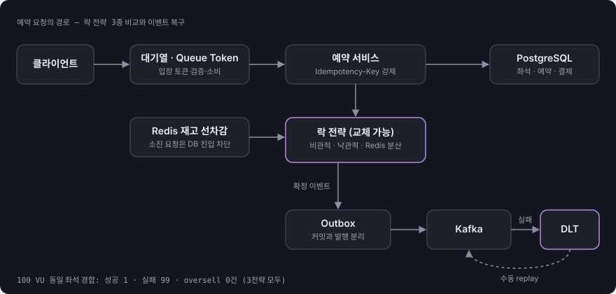

# Concert Booking


**100명이 같은 좌석에 몰려도 중복 판매 0건.**
락 전략 3종(비관적·낙관적·Redis 분산)을 같은 조건에서 실측 비교하고,
결제/만료 race·멱등성·이벤트 유실 복구까지 검증한 좌석 예약 백엔드입니다.

`Java 21` `Spring Boot` `PostgreSQL` `Redis(Redisson)` `Kafka` `JPA` `Flyway` `Testcontainers` `k6`



## 핵심 결과

### 1. 동일 좌석 경합 — 중복 판매 0건

- **문제** — 동일 좌석에 동시 예매가 몰리면 중복 판매(oversell)가 발생할 수 있다.
- **해결** — 세 락 전략을 같은 도메인에 전략 패턴으로 구현하고, k6 시나리오를 전략만 바꿔 동일 조건 실행.
- **결과** — 100 VU 동일 좌석 경합에서 3전략 모두 성공 1건 · oversell 0건.
  p95: 낙관 106ms / Redis 145ms / 비관 215ms. → [PERF_RESULT §4-A](docs/PERF_RESULT.md#4-measured-results)

### 2. 낙관적 락 성공률 40% 붕괴의 원인 규명

- **문제** — 서로 다른 좌석을 예매하는데도 낙관적 락 성공률이 40%로 무너졌다.
- **해결** — 실측으로 원인 규명: 좌석이 달라도 모든 예매가 `ConcertSchedule.availableSeats`
  공유 row의 `@Version`을 갱신하며 충돌.
- **결과** — 분산 예약 성공률 비관 100% vs 낙관 40%.
  "충돌이 드물면 낙관적 락"이라는 규칙은 공유 카운터 하나로 뒤집힌다. → [PERF_RESULT §4-B](docs/PERF_RESULT.md#4-measured-results)

### 3. 이벤트 유실 복구 — Outbox + DLT replay

- **문제** — 예약 확정 이벤트가 브로커 장애 시 유실될 수 있다.
- **해결** — Transactional Outbox로 DB 커밋과 발행을 분리, 발행 실패는 재시도 후 DEAD 격리,
  소비 실패는 Kafka DLT + 수동 replay로 복구.
- **결과** — 경로 전체를 Testcontainers 통합 테스트로 고정
  (`OutboxIntegrationTest`, `KafkaDltReplayIntegrationTest`).

### 4. race · 멱등성 · 대기열 토큰 남용 — 체크 594/594

- **문제** — 결제와 만료의 동시 도착, 같은 요청의 중복 제출, 대기열 토큰 우회.
- **해결** — Idempotency-Key, 상태 전이 불변식, 토큰 검증을 설계하고
  k6 시나리오 D/E/F를 3전략 × 3회 반복 실행.
- **결과** — 체크 594/594 통과, 중복 결제 0건 · 무권한 성공 0건.
  → [formal repeat evidence](docs/evidence/SCENARIO_D_E_F_FORMAL_2026-05-22.md)

## 실행

```bash
docker compose up -d
./gradlew bootRun --args="--reservation.strategy=distributed"   # pessimistic | optimistic | distributed

# 부하 테스트 재현
curl -X POST "http://localhost:8080/api/admin/load-test/reset?scheduleId=1&userCount=200"
k6 run k6/scenario-a.js          # 전체: bash k6/run-all.sh
```

테스트:

```bash
./gradlew test                   # Testcontainers (PostgreSQL·Kafka·Redis 실컨테이너)
```

## 문서

| 문서 | 내용 |
| --- | --- |
| [PERF_RESULT](docs/PERF_RESULT.md) | k6 측정 결과 전체 — 측정/검증 구분, 재현 방법 |
| [ARCHITECTURE](docs/ARCHITECTURE.md) | 구조와 설계 결정 |
| [LOCK_STRATEGY_GUIDE](docs/LOCK_STRATEGY_GUIDE.md) | 락 전략별 구현과 트레이드오프 |
| [TESTING](docs/TESTING.md) | 테스트 전략 |
| [RUNBOOK](docs/RUNBOOK.md) | 운영 유틸리티 (재고 보정, DLT replay) |
| [LIMITATIONS](docs/LIMITATIONS.md) | 한계 |
| [LEGACY_README](docs/LEGACY_README.md) | 이전 상세 README (전체 서사) |

## 주장하지 않는 것

- 모든 수치는 **로컬 Docker 단일 머신** 측정값입니다. 운영 성능·SLO 주장이 아닙니다.
- A/B 시나리오는 샘플이 작아 p99를 주장하지 않습니다.
- 결제는 mock 즉시 성공 구조로, 외부 PG latency·webhook 흐름은 포함하지 않습니다.
