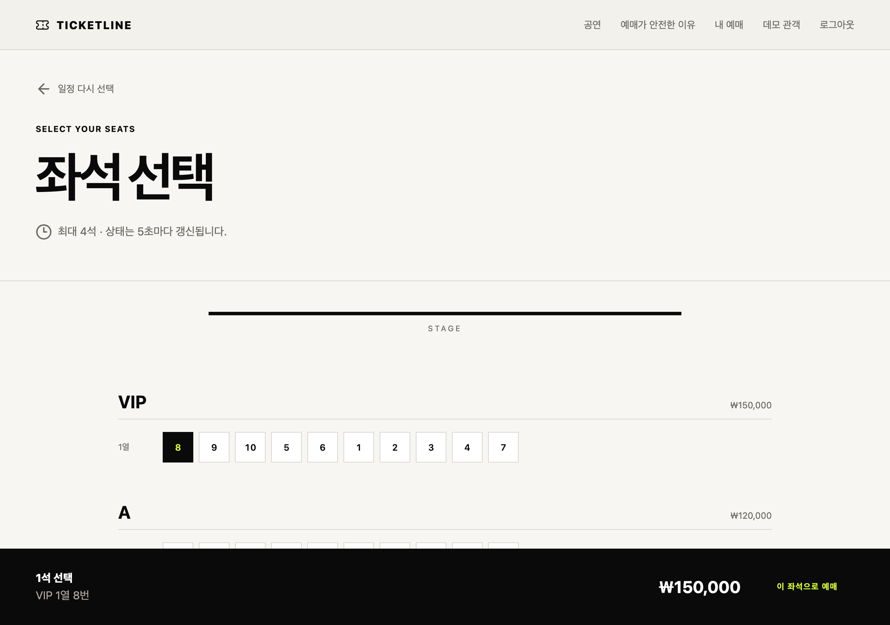
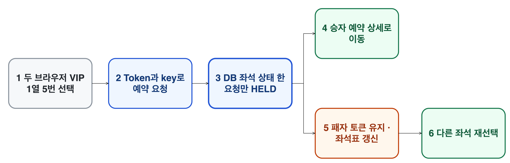
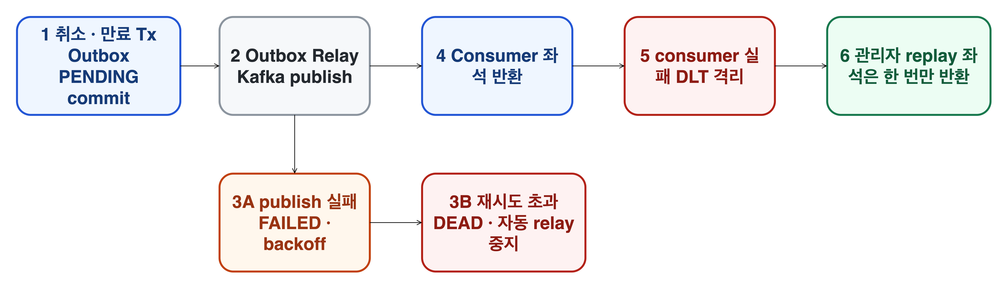

# Concert Booking

같은 좌석을 놓친 사용자가 오류 화면에 갇히지 않고, 최신 좌석표를 받아 예매를 계속할 수 있도록 만든
Spring Boot + React 예약 프로젝트입니다.

> 위 이미지는 이 저장소의 <code>web/</code> 클라이언트를 실제 E2E 스택에 붙여 좌석을 하나 고른 뒤
> 캡처한 화면입니다. 다시 찍으려면 <code>(cd web && node scripts/capture-readme-screen.mjs)</code>.
> 가상의 서비스 화면이나 운영 트래픽 수치를 사용하지 않습니다.

## 이 저장소에서 확인할 것

| 질문 | 구현으로 답한 내용 |
| --- | --- |
| 두 사용자가 같은 좌석을 누르면 어떻게 되는가? | 한 명만 예약하고, 패자는 최신 좌석표에서 다른 좌석을 선택할 수 있습니다. |
| 응답을 받지 못해 같은 요청을 다시 보내면 어떻게 되는가? | Queue Token과 idempotency key를 다시 사용해도 예약은 한 건으로 수렴합니다. |
| 결제하지 않은 좌석은 언제 돌아오는가? | 취소·만료 상태 전이와 좌석 반환 이벤트를 분리하고, 반환은 멱등 처리합니다. |
| Kafka 발행이나 consumer 처리가 실패하면 어떻게 되는가? | Outbox retry/DEAD와 DLT manual replay 경계를 별도 사례로 검증합니다. |

## 프로젝트가 바뀐 과정

| 시기 | 출발점 | 다음 단계로 넘어간 이유 |
| --- | --- | --- |
| 2026년 2월 | 같은 좌석에 대한 동시 요청과 락 전략을 실험 | 서버가 한 명만 성공시키는 것만으로는 사용자 경험을 설명할 수 없었습니다. |
| 2026년 5월 | Queue Token, idempotency, Outbox, DLT, 상태 전이 보강 | 실패를 감지하는 데서 끝내지 않고 재시도·격리·복구 경계를 코드로 남겼습니다. |
| 2026년 7월 | React 클라이언트와 Playwright E2E 연결 | 대기열부터 결제·취소까지 실제 화면에서 이어지는지 다시 확인했습니다. |

## 사용자가 지나가는 흐름

1. 공연을 찾고 로그인합니다.
2. 대기열에 들어가 <code>READY</code>가 되면 입장 토큰을 받습니다.
3. 키보드로 좌석을 고르고 예약합니다.
4. 예약 만료 시각을 확인하고 데모 결제를 완료합니다.
5. 내 예약에서 공연·일정·좌석·결제 상태를 확인하거나 취소합니다.

결제 화면은 실제 PG처럼 보이는 카드 입력을 받지 않습니다. 예약 상태 전이와 중복 요청 방어에 필요한
**데모 결제**만 제공합니다.

## 전환점: 정합성만 맞아서는 제품 흐름이 아니었다

처음에는 “같은 좌석을 동시에 요청하면 한 명만 성공하는가?”만 확인했습니다. React 화면을 붙여보니
서버가 정답을 내는 것만으로는 부족했습니다.

- 패자가 충돌 메시지만 보고 멈추면 다시 공연 목록부터 들어가야 했습니다.
- Queue Token 응답이 유실되면 서버에 토큰이 있어도 화면은 입장할 방법을 잃었습니다.
- 취소·만료 뒤 좌석이 돌아오는 시점이 화면의 최신 좌석 상태와 맞아야 했습니다.

그래서 성공한 요청의 수보다 **실패한 사용자가 어디서 다시 이어가는지**를 제품 계약에 포함했습니다.

## 1. 좌석 경쟁 뒤 복구

편집 원본: [seat-loser-recovery.drawio](docs/assets/architecture/seat-loser-recovery.drawio)

그림 transcript:

1. 두 브라우저가 VIP 1열 5번을 선택합니다.
2. 각 사용자는 자신의 Queue Token과 idempotency key로 예약을 요청합니다.
3. DB 좌석 상태를 기준으로 한 요청만 <code>HELD</code>가 됩니다.
4. 승자는 예약 상세로 이동합니다.
5. 패자는 Queue Token을 잃지 않고 최신 좌석표를 다시 받습니다.
6. 패자는 다른 좌석을 골라 예매를 계속합니다.

| 단계 | 서버 판단 | 화면의 다음 행동 |
| --- | --- | --- |
| 두 브라우저가 같은 좌석을 선택 | DB 좌석 상태를 최종 기준으로 한 요청만 성공 | 승자는 예약 상세로 이동 |
| 두 번째 요청이 충돌 | 실패한 예약에서는 Queue Token을 소비하지 않음 | 패자는 최신 좌석표를 다시 받음 |
| 패자가 다른 좌석을 선택 | 남아 있는 토큰과 새 idempotency key로 재요청 | 예매 흐름을 중단하지 않고 계속 진행 |

브라우저 회귀 테스트는 두 독립 context가 같은 좌석을 요청하고, 승자 한 명과 복구 가능한 패자 한 명으로
끝나는지를 확인합니다.

근거:

- [두 브라우저 좌석 경쟁 E2E](web/e2e/booking.spec.ts)
- [동일 좌석 동시 요청 통합 테스트](src/test/java/com/concert/booking/integration/ConcurrencyIntegrationTest.java)
- [Queue Token 성공 후 소비·실패 후 보존](src/test/java/com/concert/booking/integration/QueueTokenPolicyIntegrationTest.java)

## 2. 응답 유실과 중복 요청

Queue Token 발급은 Redis Lua 한 번으로 기존 토큰 확인, 순위 검증, 토큰 저장, queue 제거를 처리합니다.
발급 응답이 사라져 사용자가 다시 요청해도 같은 유효 토큰을 돌려줍니다.

예약과 결제는 <code>Idempotency-Key</code>를 사용합니다.

- 같은 key와 같은 요청은 기존 결과를 돌려줍니다.
- 같은 key로 다른 좌석을 요청하면 409로 거부합니다.
- 오래 멈춘 <code>PROCESSING</code> claim은 회수한 뒤 다시 처리할 수 있습니다.
- 동시 중복 요청도 DB unique constraint와 application service에서 한 건으로 수렴합니다.

근거:

- [Queue 응답 유실·예약 중복 E2E](web/e2e/booking.spec.ts)
- [Queue 발급 멱등성 통합 테스트](src/test/java/com/concert/booking/integration/QueueServiceTest.java)
- [예약 idempotency 통합 테스트](src/test/java/com/concert/booking/integration/ReservationIdempotencyIntegrationTest.java)
- [결제 idempotency 통합 테스트](src/test/java/com/concert/booking/integration/PaymentIdempotencyIntegrationTest.java)

## 3. 취소·만료 뒤 좌석 반환

결제, 취소, 만료는 같은 reservation row를 잠그고 도메인 상태 전이를 통과합니다. 취소와 만료 transaction은
좌석을 직접 여러 번 바꾸지 않고 Outbox에 반환 의도를 남깁니다.

<code>reservation.cancelled</code> 또는 만료 이벤트를 받은 consumer는 <code>HELD</code> 좌석만 반환합니다.
같은 이벤트를 다시 받아도 좌석과 재고는 한 번만 복구됩니다.

근거:

- [취소·만료 좌석 반환 E2E](web/e2e/booking.spec.ts)
- [결제·취소·만료 race 통합 테스트](src/test/java/com/concert/booking/integration/ReservationStateTransitionRaceIntegrationTest.java)
- [좌석 반환 멱등성 통합 테스트](src/test/java/com/concert/booking/integration/SeatReleaseIdempotencyIntegrationTest.java)

## 별도 사례: Outbox와 DLT 복구

좌석 경쟁은 동기 요청의 정합성 문제이고, Outbox/DLT는 commit 뒤 비동기 전달 실패 문제입니다. 두 사례를
하나의 “락 성능” 이야기로 섞지 않습니다.

편집 원본: [event-recovery-boundaries.drawio](docs/assets/architecture/event-recovery-boundaries.drawio)

그림 transcript:

1. 취소·만료 transaction이 예약 상태와 Outbox <code>PENDING</code>을 함께 commit합니다.
2. Outbox Relay가 Kafka publish를 시도합니다.
3. publish가 실패하면 <code>FAILED</code>와 backoff를 기록하고, 재시도를 초과하면
   <code>DEAD</code>에서 멈춥니다.
4. publish에 성공한 이벤트는 consumer가 좌석 반환을 처리합니다.
5. consumer 처리가 실패한 메시지는 DLT로 격리합니다.
6. 관리자가 원인을 확인한 뒤 replay해도 좌석은 한 번만 반환됩니다.

<code>DEAD</code>는 relay 실패 경계이고 DLT는 consumer 실패 경계입니다. 그림의 두 실패 경로를 하나의
직선적인 상태 전이로 해석하지 않습니다.

| 경계 | 실패했을 때 | 복구 방식 |
| --- | --- | --- |
| 비즈니스 transaction | rollback | Outbox event도 저장되지 않음 |
| Outbox relay → Kafka | publish 실패 | <code>FAILED</code>와 <code>nextAttemptAt</code>을 남기고 재시도 |
| 최대 relay 재시도 초과 | 계속 publish 실패 | <code>DEAD</code>로 격리하고 자동 relay에서 제외 |
| Kafka consumer | 좌석 반환 처리 실패 | DLT로 격리한 뒤 관리자 권한으로 제한된 건수만 manual replay |
| 같은 이벤트 재전달 | 이미 반환된 좌석 | consumer idempotency로 중복 반환 방지 |

근거:

- [Outbox 저장·retry·DEAD 통합 테스트](src/test/java/com/concert/booking/integration/OutboxIntegrationTest.java)
- [DLT 격리·manual replay 통합 테스트](src/test/java/com/concert/booking/integration/KafkaDltReplayIntegrationTest.java)
- [상세 실패 경계](docs/ARCHITECTURE.md)

Outbox는 exactly-once를 보장하지 않습니다. 중복 전달을 전제로 consumer가 같은 결과로 수렴하게 만들었습니다.

## 재현

### 제품 데모

~~~bash
cp .env.example .env
# DB_PASSWORD와 JWT_SECRET을 로컬 전용 값으로 교체
docker compose -f docker-compose.yml -f docker-compose.demo.yml up --build --wait web
~~~

브라우저에서 <http://localhost:4173>을 엽니다.

~~~bash
docker compose -f docker-compose.yml -f docker-compose.demo.yml down
~~~

### 검증

~~~bash
./gradlew test --no-daemon
./gradlew build --no-daemon
cd web
npm ci
npm run typecheck
npm run lint
npm run test:run
npm run build
~~~

Docker E2E는 PostgreSQL, Redis, Kafka, app, web을 함께 실행합니다.

~~~bash
docker compose -f docker-compose.yml -f docker-compose.e2e.yml up -d --build --wait web
(cd web && E2E_BASE_URL=http://localhost:4173 npm run e2e)
docker compose -f docker-compose.yml -f docker-compose.e2e.yml down -v
~~~

## 저장소 구조

~~~text
src/                      Spring Boot 애플리케이션과 Testcontainers 테스트
web/                      React · Vite · TypeScript 클라이언트와 Playwright E2E
docs/                     설계, 테스트 근거, 한계, runbook
k6/                       과거 로컬 측정과 재현 스크립트
docker-compose.demo.yml   사람이 둘러보는 고정 데모 데이터
docker-compose.e2e.yml    테스트 전용 fixture와 failure 경계
~~~

주요 기술은 Java 21, Spring Boot, PostgreSQL, Redis, Kafka이며, 제품 화면은 React와 TypeScript로
구현했습니다.

## 주장하지 않는 것

- 로컬 k6 결과를 운영 TPS, capacity, SLO로 해석하지 않습니다.
- 세 락 전략의 단일 실행 수치를 “우월한 전략”의 근거로 사용하지 않습니다.
- Outbox/DLT utility를 자동 장애 복구나 exactly-once 보장으로 표현하지 않습니다.
- 데모 결제를 실제 PG 연동으로 표현하지 않습니다.
- Docker demo와 E2E 결과를 공개 운영 서비스의 가용성으로 확장하지 않습니다.

## 더 자세한 문서

- [실패 경계 중심 아키텍처](docs/ARCHITECTURE.md)
- [검증 근거와 실행 명령](docs/TESTING.md)
- [구현 상세](docs/DESIGN.md)
- [로컬 재현 절차](docs/RUNBOOK.md)
- [현재 한계](docs/LIMITATIONS.md)
- [과거 측정 기록과 해석 경계](docs/PERF_RESULT.md)
