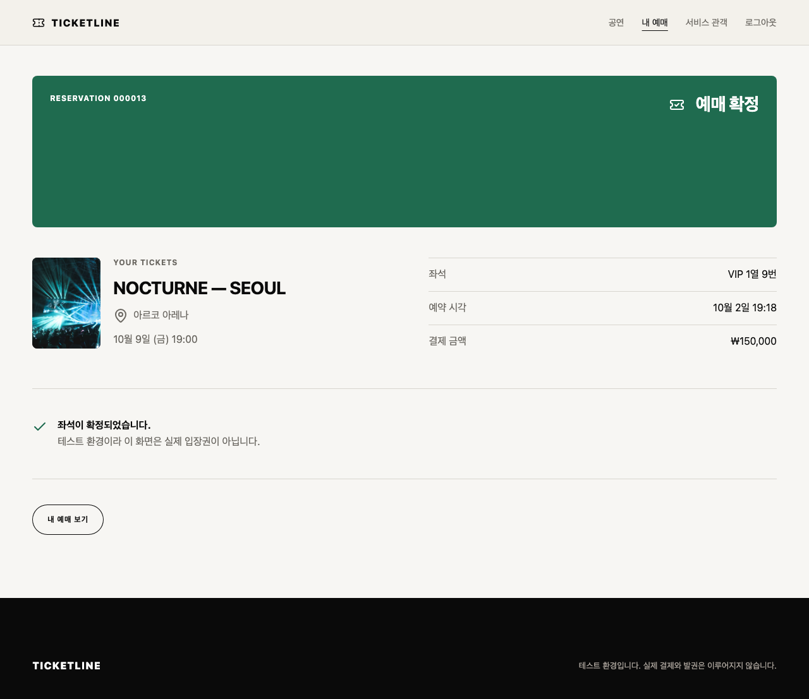
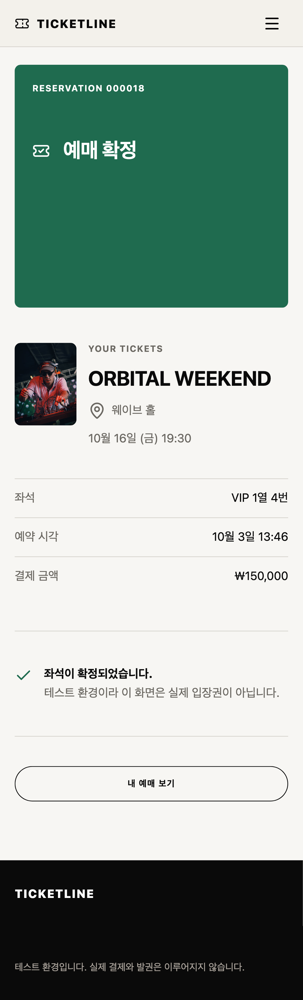
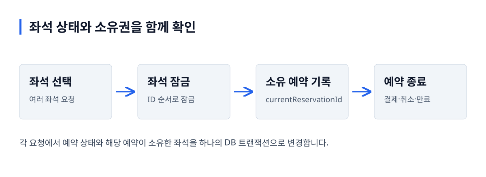

# Concert Booking

**좌석을 누가 소유하는지, 예약이 끝날 때 무엇이 함께 바뀌는지 다룹니다.**

공연 선택부터 좌석 선점·테스트 결제·예매 확인까지 실행하는 개인 프로젝트입니다. Java 21, Spring Boot, Spring MVC, JPA, PostgreSQL과 React·TypeScript를 사용합니다. 기본 서비스의 필수 저장소는 PostgreSQL 하나입니다.

[핵심 판단](#핵심-판단) · [검증 결과](#검증-결과) · [로컬 실행](#로컬-실행) · [코드 읽기](#코드-읽기)

## 실제 화면



실제 로컬 API로 좌석을 선점하고 테스트 결제를 완료한 화면입니다. 공연·관객·좌석은 합성 자료이며 실제 청구나 발권은 없습니다.

<details>
<summary>모바일 화면</summary>



</details>

## 사용 흐름과 처리 구조

가입 → 공연·좌석 선택 → 선점 → 테스트 결제 → 예매 확인 / 결제 전 취소·만료



그림 설명: 좌석 선택 → 좌석 잠금 → 소유 예약 기록 → 예약 종료. 각 요청에서 예약 상태와 해당 예약이 소유한 좌석을 하나의 DB 트랜잭션으로 변경합니다.

## 핵심 판단

| 문제 | 선택 | 확인한 근거 |
|---|---|---|
| A의 오래된 취소 이벤트가 B가 재선점한 좌석을 반환할 수 있었습니다. | 현재 예약 ID를 좌석에 기록하고 확정·반환 시 소유권을 검사합니다. | [Seat](src/main/java/com/concert/booking/domain/Seat.java), [재처리 회귀](src/test/java/com/concert/booking/integration/SeatReleaseIdempotencyIntegrationTest.java) |
| 다른 좌석도 공유 잔여석 카운터에서 경합했습니다. | 기본 경로는 좌석별 DB 잠금, 잔여석은 좌석 상태로 조회합니다. | [SeatLockReservationService](src/main/java/com/concert/booking/service/reservation/SeatLockReservationService.java) |
| 취소 완료와 좌석 반환의 시점이 분리돼 있었습니다. | 취소·만료와 좌석 반환을 하나의 트랜잭션으로 처리합니다. | [기본 서비스 통합 테스트](src/test/java/com/concert/booking/integration/ServiceBookingIntegrationTest.java) |

## 검증 결과

2026-10-02 로컬 검증: 백엔드 **106개**, 프론트 단위 **14개**, 실제 API 데스크톱·모바일 **E2E 4개 통과**. 같은 좌석의 중복 성공, 여러 좌석의 부분 성공, 중복 요청, 결제·만료 경쟁, 취소 후 재선점과 과거 이벤트 재처리를 확인했습니다.

단일 로컬 동시 요청 실험에서 같은 좌석 8개 중 성공 1·거절 7, 서로 다른 좌석 8개 중 성공 8·거절 0을 관측했습니다. 워밍업 없는 조건별 1회이며 HTTP 성능 개선율이 아닙니다.

[검증 기록](docs/VERIFICATION.md) · [원표본·조건](docs/evidence/2026-10-02/service-holds/summary.json) · [과거 전략 비교의 해석](docs/PERF_RESULT.md)

## 로컬 실행

```bash
python3 scripts/init-service-env.py
docker compose --env-file .env.service -p concert-rebuild -f compose.service.yml up -d --build
curl http://localhost:18082/actuator/health
```

`http://localhost:4176`에서 가입한 뒤 예매합니다. 미결제 선점은 5분 후 만료됩니다. 기본 시연에는 Redis 대기열·Kafka가 필요하지 않습니다. 처음 실행할 때 DB 비밀번호·서명 키를 무작위로 생성합니다. `.env.service`는 Git에 올리지 않으며, 초기화 스크립트는 기존 파일을 덮어쓰지 않습니다. 기존 DB를 유지할 때는 같은 비밀번호 파일을 사용합니다.

```bash
./gradlew test
cd web
npm ci
npm run test:run
npm run lint
npm run build
npx playwright test -c playwright.service.config.ts
```

종료: `docker compose --env-file .env.service -p concert-rebuild -f compose.service.yml stop`. DB 볼륨을 보존합니다.

## 범위와 한계

실제 PG·결제 후 환불·발권·대규모 티켓 오픈은 검증하지 않았습니다. 이전의 Redis 대기열·Kafka 반환·세 가지 락 전략은 별도 실험 경로에 보존했습니다. 과거 40%와 100%는 전략별 성공률이며, 혼합 부하 지연을 성공한 예약의 지연 개선으로 표현하지 않습니다.

이번 개인 보강은 AI 지원으로 구현하고 로컬에서 검증했습니다. 코드로 확인한 동작·실험 관측·미검증 범위를 구분하며, 실제로 겪지 않은 운영 장애나 팀 전체 결과를 개인 성과로 표현하지 않습니다.

## 코드 읽기

[ReservationController](src/main/java/com/concert/booking/controller/ReservationController.java) → [SeatLockReservationService](src/main/java/com/concert/booking/service/reservation/SeatLockReservationService.java) → [ReservationCreationService](src/main/java/com/concert/booking/service/reservation/ReservationCreationService.java) → [SeatRepository](src/main/java/com/concert/booking/repository/SeatRepository.java). [트랜잭션·실패 조건·변경 과제](docs/SERVICE_GUIDE.md)를 함께 봅니다.

[기존 실험 README](docs/archive/README-before-service.md) · [기존 설계와 현재 모드의 구분](docs/ARCHITECTURE.md)
