# Design

Concert Booking은 고동시성 콘서트 예매 상황에서 좌석 정합성, 입장 제어, 결제/만료 race, 이벤트 발행 실패를 다루는 Spring Boot 백엔드입니다. 이 문서는 현재 코드와 테스트로 확인된 설계를 기준으로 작성합니다.

## 1. System Overview

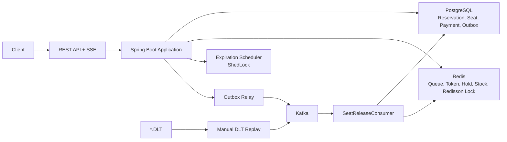

역할을 일부러 나눴습니다. 예매 서비스는 좌석 선점과 상태 전이에 집중하고, Kafka consumer는 취소/만료 이후 좌석 반환을 멱등적으로 처리합니다. Redis stock은 빠른 선검증용이고, 최종 정합성 기준은 DB입니다.
좌석 조회는 항상 요청 `scheduleId`와 `seatIds`를 함께 조건으로 걸어, 다른 공연 일정의 좌석이 예매에 섞이지 않도록 합니다.

## 2. Data Model

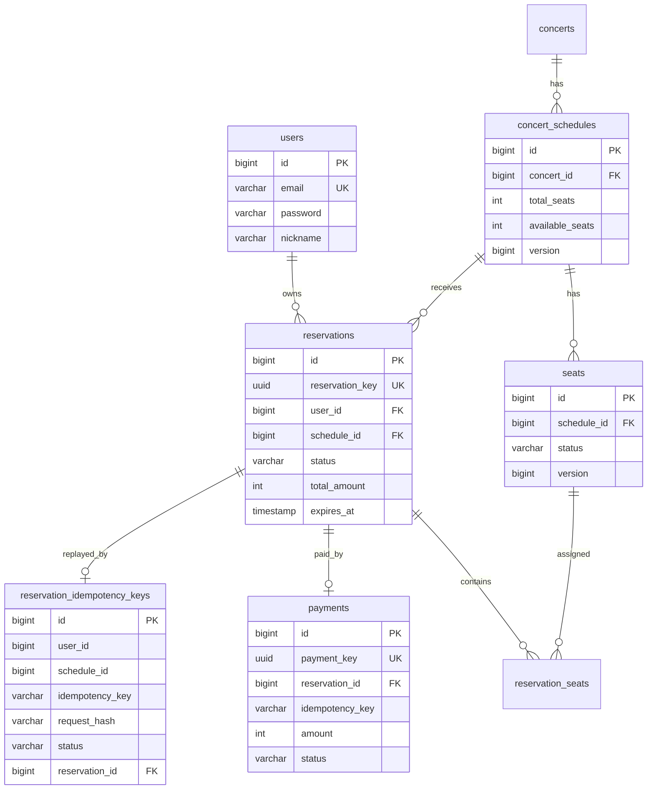

중요한 DB 제약:

| 제약 | 목적 |
| --- | --- |
| `reservation_idempotency_keys(user_id, schedule_id, idempotency_key)` unique | 같은 예매 재시도 중복 생성 방지 |
| `payments(reservation_id, idempotency_key)` unique | 같은 결제 재시도 replay |
| `payments(reservation_id)` unique | 다른 idempotency key로 같은 예매를 중복 결제하는 경로 차단 |
| `reservation_seats(reservation_id, seat_id)` unique | 같은 예매 안에서 같은 좌석 중복 배정 방지 |
| `seats(schedule_id, section, row_number, seat_number)` unique | 같은 공연 일정의 좌석 중복 생성 방지 |

## 3. Reservation State

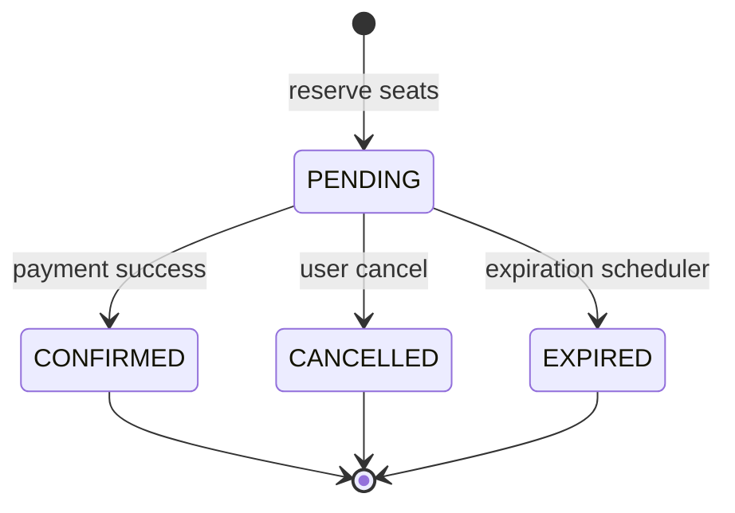

허용하는 전이는 `PENDING`에서 시작하는 세 가지뿐입니다.

| 전이 | 트리거 | 보호 방식 |
| --- | --- | --- |
| `PENDING -> CONFIRMED` | 결제 성공 | `ReservationRepository.findByIdForUpdate()` |
| `PENDING -> CANCELLED` | 사용자 취소 | `ReservationCancellationService`에서 row lock |
| `PENDING -> EXPIRED` | 만료 스케줄러 | id별 별도 트랜잭션과 row lock |

`CONFIRMED`는 취소/만료로 바뀌지 않고, `CANCELLED`/`EXPIRED`는 결제로 확정되지 않습니다. 중복 취소와 중복 만료는 좌석/재고를 다시 올리지 않도록 no-op 또는 상태 예외로 처리합니다.

## 4. Queue And Admission Token

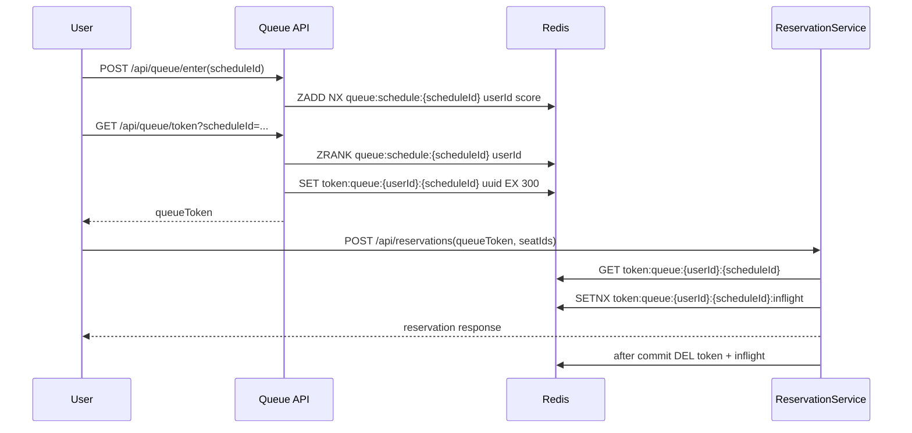

토큰 정책:

- `ReservationRequest.queueToken`은 필수입니다.
- Redis key는 `token:queue:{userId}:{scheduleId}`입니다.
- 요청 token 값이 Redis 저장 값과 같아야 합니다.
- 다른 사용자나 다른 schedule의 token은 실패합니다.
- 예매 성공 후에만 token을 삭제합니다.
- 예매 실패 시 token은 남겨서 사용자가 다른 좌석으로 다시 시도할 수 있게 합니다.
- 동시 재사용은 inflight key의 `SETNX + TTL`로 막습니다.

## 5. Reservation Success Flow

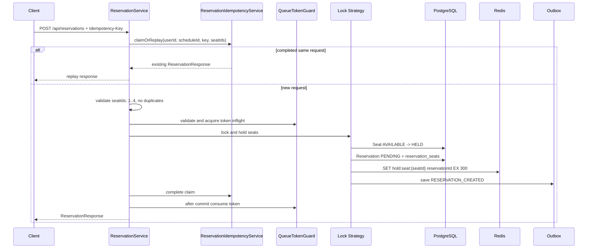

세 예매 전략은 같은 API 계약을 공유합니다. 차이는 좌석과 schedule 재고를 보호하는 방식입니다.

## 6. Lock Strategy Comparison

| 전략 | 직렬화 지점 | 장점 | 한계 | 검증 |
| --- | --- | --- | --- | --- |
| Pessimistic Lock | DB `SELECT ... FOR UPDATE` | 결과가 직관적이고 높은 경합에서 안정적 | 대기 요청이 DB connection과 row lock을 점유 | k6 A/B/C, 통합 테스트 |
| Optimistic Lock | JPA `@Version` + 제한된 retry | 낮은 경합에서 lock wait가 적음 | 공유 row인 `ConcertSchedule.availableSeats` 충돌 시 성공률 하락 | k6 A/B/C |
| Redis Distributed Lock | Redis stock pre-check + Redisson MultiLock + DB 확인 | 소진 이후 실패 요청을 DB 전에 차단 | Redis stock과 DB 불일치 가능, reconciliation 필요 | k6 A/B/C, stock failure tests |

분산 락 흐름:

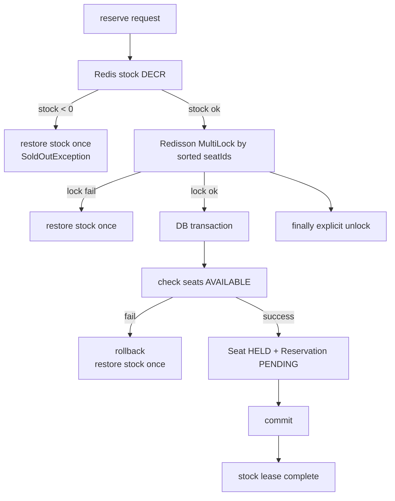

`tryLock`의 `waitTime`은 락 획득을 기다리는 시간이고, `leaseTime`은 비정상 종료에 대비한 자동 해제 시간입니다. 정상 흐름에서는 `finally`에서 `unlock()`을 호출합니다.

## 7. Payment And Expiration Race

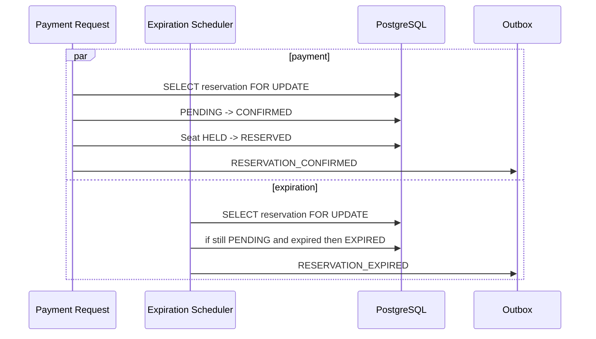

둘 중 먼저 row lock을 잡은 전이만 성공합니다. 결제가 먼저 성공하면 만료는 skip되고, 만료가 먼저 성공하면 결제는 상태 예외로 실패합니다. 이 정책은 `ReservationStateTransitionRaceIntegrationTest`에서 결제/만료, 결제/취소, 취소/만료 조합으로 검증합니다.

## 8. Seat Release

좌석 반환은 취소/만료 상태 전이 트랜잭션에서 직접 하지 않습니다. 상태 전이는 outbox event만 남기고, `SeatReleaseConsumer`가 이벤트를 받아 반환합니다.

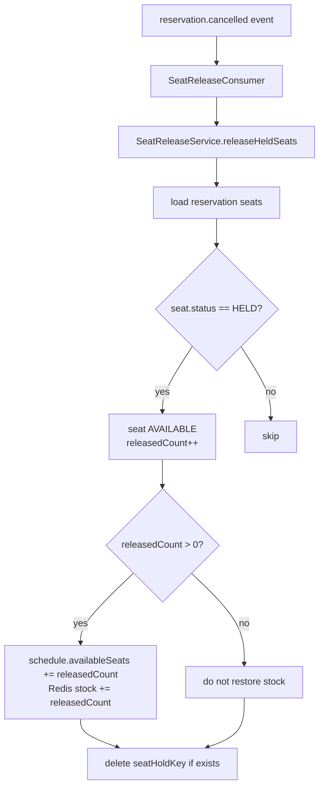

이벤트가 중복 도착해도 `HELD` 좌석만 반환하므로 `availableSeats`와 Redis stock이 중복 증가하지 않습니다. `RESERVED` 좌석은 취소/만료 이벤트로 반환하지 않습니다.

## 9. Outbox Event Flow

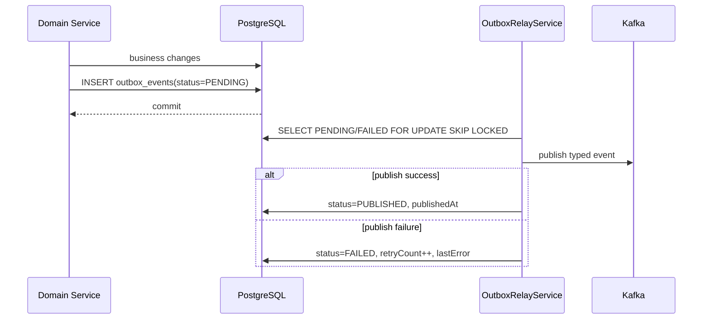

이벤트 매핑:

| Outbox eventType | Kafka topic | 용도 |
| --- | --- | --- |
| `RESERVATION_CREATED` | `reservation.created` | 예매 생성 이벤트 |
| `RESERVATION_CONFIRMED` | `reservation.completed` | 결제 확정 이벤트 |
| `RESERVATION_CANCELLED` | `reservation.cancelled` | 사용자 취소 좌석 반환 요청 |
| `RESERVATION_EXPIRED` | `reservation.cancelled` | 만료 좌석 반환 요청 |

Outbox는 exactly-once를 보장하지 않습니다. 목적은 DB commit 이후 publish 실패로 이벤트가 사라지는 구간을 줄이는 것입니다. 중복 발행 가능성은 consumer 멱등성으로 흡수합니다.

## 10. DLT Replay Flow

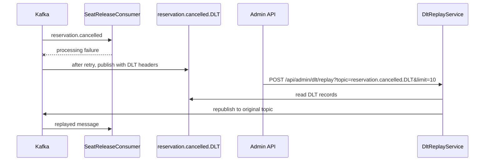

DLT topic은 Spring Kafka `DeadLetterPublishingRecoverer` 규칙으로 `원본토픽.DLT`를 사용합니다. 예: `reservation.cancelled.DLT`.

`KafkaDltReplayIntegrationTest`는 다음을 확인합니다.

- Consumer 실패 메시지가 DLT로 이동합니다.
- DLT record에 원본 topic/partition/offset/exception header가 남습니다.
- replay 후 원본 topic으로 재발행됩니다.
- 같은 DLT 메시지를 다시 replay해도 좌석/재고가 중복 복구되지 않습니다.

## 11. Redis Stock Reconciliation

Redis stock은 빠른 선검증용 캐시입니다. DB가 기준입니다.

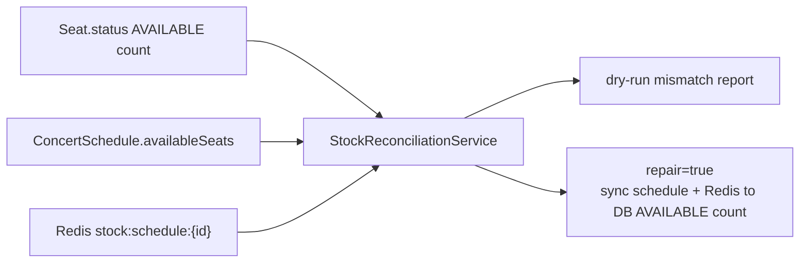

초기화 정책:

- 로컬 fixture 생성 시 DB `AVAILABLE` 좌석 수 기준으로 Redis stock을 초기화합니다.
- `/api/admin/reset`과 load-test reset은 `overwrite=true`로 DB 기준 값을 씁니다.
- `/api/admin/schedules/{scheduleId}/stock/initialize?overwrite=false`는 기존 key가 있으면 보존합니다.
- 분산 예매 진입 시 stock key가 없으면 lazy init을 수행합니다.
- 좌석 조회 API는 stock을 만들거나 덮어쓰지 않습니다.
- 일반 `/api/admin/**` utility는 `ROLE_ADMIN` 권한이 필요합니다.

Reconciliation endpoint:

```text
POST /api/admin/schedules/{scheduleId}/stock/reconcile?repair=false
POST /api/admin/schedules/{scheduleId}/stock/reconcile?repair=true
```

이 기능은 manual reconciliation utility입니다. 자동 운영 보정 기능으로 주장하지 않습니다.
`repair=true`는 관리자 권한으로 수동 실행하는 경로이며, Redis를 단일 진실 공급원으로 만들지 않습니다.

## 12. k6 Reproducibility

부하 테스트 전용 reset endpoint는 `@Profile("!prod")`로 제한합니다.

```text
POST /api/admin/load-test/reset?scheduleId=1&userCount=200
GET  /api/admin/load-test/summary?scheduleId=1
POST /api/admin/load-test/reservations/{id}/expire
POST /api/admin/load-test/tokens/expire?userId={id}&scheduleId={id}
```

reset이 맞추는 상태:

- 대상 schedule의 reservations, payments, idempotency, reservation_seats 삭제
- 좌석 50개 `AVAILABLE`
- `ConcertSchedule.availableSeats=50`
- Redis stock=50
- queue, active, token, inflight, seat hold key 삭제
- `loadtest-user-{n}@k6.local` 사용자 보장

## 13. Boundaries

- 결제는 mock payment 즉시 성공 구조입니다.
- Admin API는 로컬/포트폴리오 검증용입니다. 관리자 인증 모델은 별도 과제입니다.
- Kafka replay는 manual utility입니다.
- Redis 장애 자동 fallback은 구현하지 않았습니다.
- k6 A/B/C 결과는 로컬 Docker 단일 실행 기준입니다.
- D/E/F k6 시나리오는 script added, result pending입니다.
